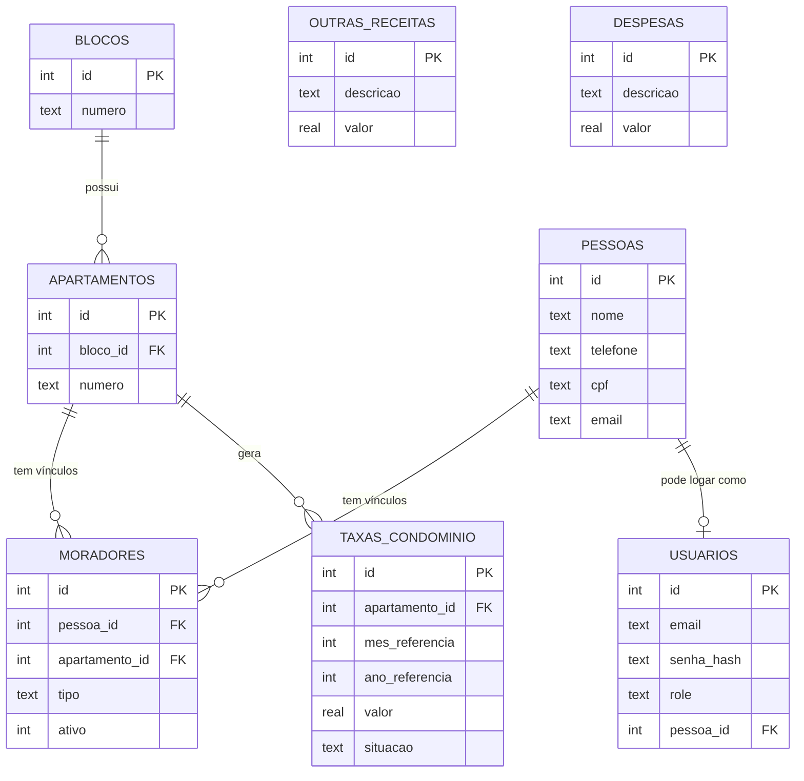

# Modelagem de Dados — SQLite

> Estrutura de tabelas derivada de [`regras-de-negocio.md`](./regras-de-negocio.md).
> Tipos em sintaxe SQLite; `TEXT` usado para enums (validados na camada de aplicação).
>
> **Revisão 2**: separação de `pessoas` (identidade) e `moradores` (vínculo pessoa↔apartamento),
> para suportar o caso do protótipo em que uma mesma pessoa pode ter múltiplos apartamentos
> ("Meus Apartamentos"). Ver seção 12 (Changelog) para o racional completo.

## Diagrama de Relacionamento (visão geral)



## 1. `blocos`

| Coluna | Tipo | Constraints |
|---|---|---|
| id | INTEGER | PK AUTOINCREMENT |
| numero | TEXT | NOT NULL, UNIQUE |

```sql
CREATE TABLE blocos (
  id INTEGER PRIMARY KEY AUTOINCREMENT,
  numero TEXT NOT NULL UNIQUE
);
```

## 2. `apartamentos`

| Coluna | Tipo | Constraints |
|---|---|---|
| id | INTEGER | PK AUTOINCREMENT |
| bloco_id | INTEGER | NOT NULL, FK → blocos.id |
| numero | TEXT | NOT NULL |

```sql
CREATE TABLE apartamentos (
  id INTEGER PRIMARY KEY AUTOINCREMENT,
  bloco_id INTEGER NOT NULL REFERENCES blocos(id) ON DELETE RESTRICT,
  numero TEXT NOT NULL,
  UNIQUE (bloco_id, numero)
);
```

## 3. `pessoas`

Identidade única da pessoa (independe de quantos apartamentos ela tenha vínculo).

| Coluna | Tipo | Constraints |
|---|---|---|
| id | INTEGER | PK AUTOINCREMENT |
| nome | TEXT | NOT NULL |
| telefone | TEXT | NOT NULL |
| cpf | TEXT | NULL — obrigatório na aplicação apenas se a pessoa possuir ao menos um vínculo com `tipo='proprietario'` (não dá para expressar essa regra num CHECK, pois depende de outra tabela) |
| email | TEXT | NOT NULL, UNIQUE |
| created_at | TEXT | NOT NULL DEFAULT (datetime('now')) |

```sql
CREATE TABLE pessoas (
  id INTEGER PRIMARY KEY AUTOINCREMENT,
  nome TEXT NOT NULL,
  telefone TEXT NOT NULL,
  cpf TEXT,
  email TEXT NOT NULL UNIQUE,
  created_at TEXT NOT NULL DEFAULT (datetime('now'))
);
```

## 4. `moradores` (vínculo pessoa ↔ apartamento)

Tabela de associação: representa "esta pessoa é proprietária/inquilina deste apartamento".
Uma mesma pessoa pode ter várias linhas aqui (vários apartamentos), inclusive com tipos
diferentes em apartamentos diferentes (ex.: proprietário no 203, inquilino em outro).

| Coluna | Tipo | Constraints |
|---|---|---|
| id | INTEGER | PK AUTOINCREMENT |
| pessoa_id | INTEGER | NOT NULL, FK → pessoas.id |
| apartamento_id | INTEGER | NOT NULL, FK → apartamentos.id |
| tipo | TEXT | NOT NULL, CHECK IN ('proprietario', 'inquilino') |
| ativo | INTEGER | NOT NULL DEFAULT 1 (boolean 0/1) |
| created_at | TEXT | NOT NULL DEFAULT (datetime('now')) |

```sql
CREATE TABLE moradores (
  id INTEGER PRIMARY KEY AUTOINCREMENT,
  pessoa_id INTEGER NOT NULL REFERENCES pessoas(id) ON DELETE CASCADE,
  apartamento_id INTEGER NOT NULL REFERENCES apartamentos(id) ON DELETE CASCADE,
  tipo TEXT NOT NULL CHECK (tipo IN ('proprietario', 'inquilino')),
  ativo INTEGER NOT NULL DEFAULT 1,
  created_at TEXT NOT NULL DEFAULT (datetime('now'))
);

-- Garante no máximo 1 proprietário e 1 inquilino ATIVOS por apartamento,
-- sem travar o histórico de vínculos desativados (ativo = 0).
-- Um UNIQUE(apartamento_id, tipo, ativo) comum NÃO funcionaria aqui: SQLite só
-- trata NULL como distinto em constraints únicas, e 0/1 são valores normais —
-- duas linhas históricas com ativo=0 para o mesmo (apartamento_id, tipo) violariam
-- a constraint. O índice parcial abaixo resolve isso ao indexar só as linhas ativas.
CREATE UNIQUE INDEX idx_morador_ativo_unico
  ON moradores(apartamento_id, tipo)
  WHERE ativo = 1;
```

## 5. `usuarios`

| Coluna | Tipo | Constraints |
|---|---|---|
| id | INTEGER | PK AUTOINCREMENT |
| email | TEXT | NOT NULL, UNIQUE |
| senha_hash | TEXT | NOT NULL |
| role | TEXT | NOT NULL, CHECK IN ('admin', 'proprietario', 'inquilino') |
| pessoa_id | INTEGER | NULL, FK → pessoas.id (NULL apenas para role = 'admin') |
| created_at | TEXT | NOT NULL DEFAULT (datetime('now')) |

```sql
CREATE TABLE usuarios (
  id INTEGER PRIMARY KEY AUTOINCREMENT,
  email TEXT NOT NULL UNIQUE,
  senha_hash TEXT NOT NULL,
  role TEXT NOT NULL CHECK (role IN ('admin', 'proprietario', 'inquilino')),
  pessoa_id INTEGER REFERENCES pessoas(id) ON DELETE SET NULL,
  created_at TEXT NOT NULL DEFAULT (datetime('now'))
);
```

> **Invariante de aplicação (não expressável em CHECK entre tabelas no SQLite):**
> se `usuarios.role IN ('proprietario', 'inquilino')`, deve existir ao menos um registro em
> `moradores` com `pessoa_id = usuarios.pessoa_id` e `tipo = usuarios.role` e `ativo = 1`.
> Vale a pena cobrir isso com teste de integridade (ex.: job de auditoria ou teste de API).

## 6. `password_reset_tokens`

| Coluna | Tipo | Constraints |
|---|---|---|
| id | INTEGER | PK AUTOINCREMENT |
| usuario_id | INTEGER | NOT NULL, FK → usuarios.id |
| token | TEXT | NOT NULL, UNIQUE |
| expires_at | TEXT | NOT NULL |
| used | INTEGER | NOT NULL DEFAULT 0 |

```sql
CREATE TABLE password_reset_tokens (
  id INTEGER PRIMARY KEY AUTOINCREMENT,
  usuario_id INTEGER NOT NULL REFERENCES usuarios(id) ON DELETE CASCADE,
  token TEXT NOT NULL UNIQUE,
  expires_at TEXT NOT NULL,
  used INTEGER NOT NULL DEFAULT 0
);

CREATE INDEX idx_password_reset_usuario ON password_reset_tokens(usuario_id);
```

## 7. `taxas_condominio`

Lançamento mensal da taxa de condomínio por apartamento.

| Coluna | Tipo | Constraints |
|---|---|---|
| id | INTEGER | PK AUTOINCREMENT |
| apartamento_id | INTEGER | NOT NULL, FK → apartamentos.id |
| mes_referencia | INTEGER | NOT NULL, CHECK (1–12) |
| ano_referencia | INTEGER | NOT NULL |
| valor | REAL | NOT NULL |
| juros | REAL | NOT NULL DEFAULT 0 |
| data_pagamento | TEXT | NULL |
| situacao | TEXT | NOT NULL, CHECK IN ('adimplente', 'inadimplente') |
| meses_atraso | INTEGER | NOT NULL DEFAULT 0 |
| comprovante_path | TEXT | NULL |
| created_at | TEXT | NOT NULL DEFAULT (datetime('now')) |

```sql
CREATE TABLE taxas_condominio (
  id INTEGER PRIMARY KEY AUTOINCREMENT,
  apartamento_id INTEGER NOT NULL REFERENCES apartamentos(id) ON DELETE CASCADE,
  mes_referencia INTEGER NOT NULL CHECK (mes_referencia BETWEEN 1 AND 12),
  ano_referencia INTEGER NOT NULL,
  valor REAL NOT NULL,
  juros REAL NOT NULL DEFAULT 0,
  data_pagamento TEXT,
  situacao TEXT NOT NULL CHECK (situacao IN ('adimplente', 'inadimplente')),
  meses_atraso INTEGER NOT NULL DEFAULT 0,
  comprovante_path TEXT,
  created_at TEXT NOT NULL DEFAULT (datetime('now')),
  UNIQUE (apartamento_id, mes_referencia, ano_referencia)
);
```

## 8. `outras_receitas`

Receitas de nível condomínio, não vinculadas a apartamento (bingo, propaganda, eventos etc.).

| Coluna | Tipo | Constraints |
|---|---|---|
| id | INTEGER | PK AUTOINCREMENT |
| descricao | TEXT | NOT NULL |
| valor | REAL | NOT NULL |
| data | TEXT | NOT NULL |
| comprovante_path | TEXT | NULL |
| created_at | TEXT | NOT NULL DEFAULT (datetime('now')) |

```sql
CREATE TABLE outras_receitas (
  id INTEGER PRIMARY KEY AUTOINCREMENT,
  descricao TEXT NOT NULL,
  valor REAL NOT NULL,
  data TEXT NOT NULL,
  comprovante_path TEXT,
  created_at TEXT NOT NULL DEFAULT (datetime('now'))
);
```

## 9. `despesas`

Despesas de nível condomínio (manutenção, limpeza, reformas etc.).

| Coluna | Tipo | Constraints |
|---|---|---|
| id | INTEGER | PK AUTOINCREMENT |
| descricao | TEXT | NOT NULL |
| valor | REAL | NOT NULL |
| data | TEXT | NOT NULL |
| comprovante_path | TEXT | NULL |
| created_at | TEXT | NOT NULL DEFAULT (datetime('now')) |

```sql
CREATE TABLE despesas (
  id INTEGER PRIMARY KEY AUTOINCREMENT,
  descricao TEXT NOT NULL,
  valor REAL NOT NULL,
  data TEXT NOT NULL,
  comprovante_path TEXT,
  created_at TEXT NOT NULL DEFAULT (datetime('now'))
);
```

## 10. Índices recomendados

```sql
CREATE INDEX idx_apartamentos_bloco ON apartamentos(bloco_id);
CREATE INDEX idx_moradores_pessoa ON moradores(pessoa_id);
CREATE INDEX idx_moradores_apartamento ON moradores(apartamento_id);
CREATE INDEX idx_taxas_apto_periodo ON taxas_condominio(apartamento_id, ano_referencia, mes_referencia);
CREATE INDEX idx_outras_receitas_data ON outras_receitas(data);
CREATE INDEX idx_despesas_data ON despesas(data);
```

## 11. Valores derivados (não persistidos, calculados em query/serviço)

- **Saldo do bloco no mês** = `SUM(taxas_condominio.valor + juros paga no período) + SUM(outras_receitas do período) − SUM(despesas do período, rateada por bloco)`.
- **Total adimplente/inadimplente do bloco no mês**: agregação de `taxas_condominio.situacao` agrupado por bloco (via join `apartamentos`).
- **Meses em atraso**: pode ser mantido como coluna denormalizada (`meses_atraso`) recalculada por job/trigger de aplicação sempre que uma nova competência é gerada sem pagamento anterior.
- **"Meus Apartamentos" (tela do Proprietário/Inquilino)**: `SELECT * FROM moradores JOIN apartamentos ... WHERE pessoa_id = :pessoa_id AND ativo = 1` — agora suportado nativamente pela separação pessoa/vínculo.

## 12. Notas para seed de dados de teste (QA)

Para exercitar os cenários de teste automatizado, o seed inicial deve cobrir:
- Ao menos 2 blocos com múltiplos apartamentos cada.
- Apartamentos com: só proprietário, proprietário + inquilino, e um caso "órfão" (sem morador) para testar estados vazios.
- **Uma pessoa com vínculo ativo em mais de um apartamento** (cobre a tela "Meus Apartamentos" e valida o fix da seção 4).
- Um caso de vínculo desativado (`ativo = 0`) para o mesmo `(apartamento_id, tipo)` de um vínculo ativo — valida o índice parcial (histórico de troca de morador).
- Registros de `taxas_condominio` cobrindo os 3 estados: adimplente, inadimplente recente (1 mês) e inadimplente crônico (3+ meses).
- Usuários de cada role (admin, proprietário, inquilino) para testes de RBAC.
- Ao menos uma `outras_receitas` e uma `despesa` com `comprovante_path` preenchido e outra sem, para testar o fluxo de visualização de comprovante.

## 13. Changelog

- **Rev. 2**: Corrigido índice único de `moradores` (era `UNIQUE(apartamento_id, tipo, ativo)`,
  que quebraria ao registrar histórico de vínculos desativados) para um índice único parcial
  filtrando `ativo = 1`. Extraída a entidade `pessoas` de `moradores`, permitindo que uma mesma
  pessoa tenha vínculos com múltiplos apartamentos (suporta a tela "Meus Apartamentos" do
  protótipo). `usuarios.morador_id` foi substituído por `usuarios.pessoa_id`.
