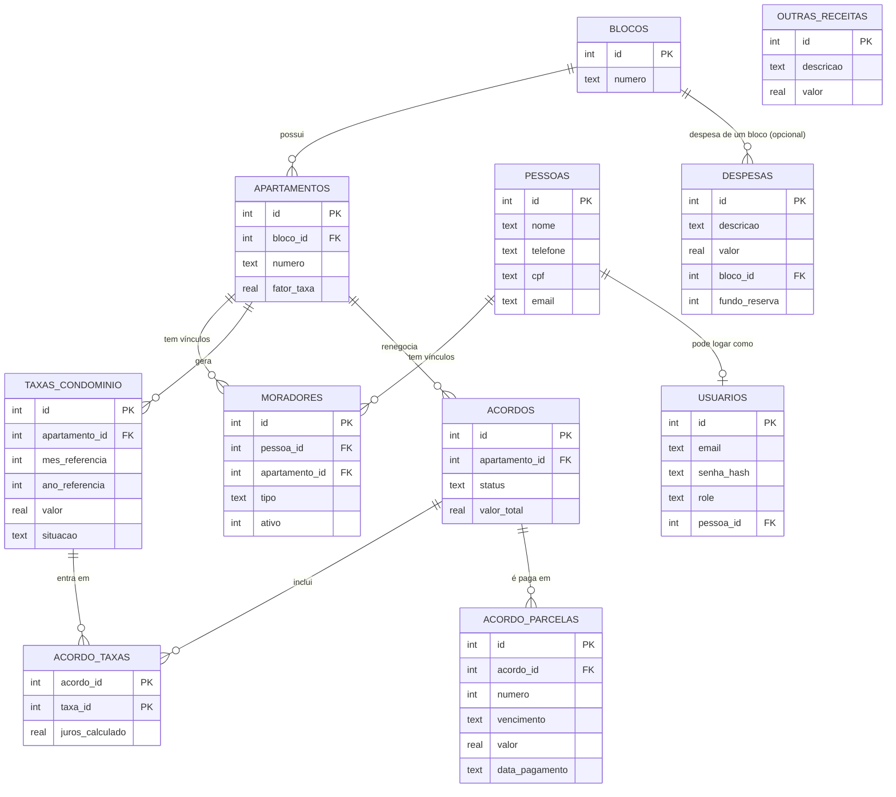

# Modelagem de Dados — SQLite

> Estrutura de tabelas derivada de [`regras-de-negocio.md`](./regras-de-negocio.md).
> Tipos em sintaxe SQLite; `TEXT` usado para enums (validados na camada de aplicação).
>
> **Revisão 2**: separação de `pessoas` (identidade) e `moradores` (vínculo pessoa↔apartamento),
> para suportar o caso do protótipo em que uma mesma pessoa pode ter múltiplos apartamentos
> ("Meus Apartamentos"). Ver seção 12 (Changelog) para o racional completo.

## Diagrama de Relacionamento (visão geral)


```mermaid
erDiagram
    BLOCOS ||--o{ APARTAMENTOS : possui
    PESSOAS ||--o{ MORADORES : "tem vínculos"
    APARTAMENTOS ||--o{ MORADORES : "tem vínculos"
    APARTAMENTOS ||--o{ TAXAS_CONDOMINIO : gera
    BLOCOS ||--o{ DESPESAS : "despesa de um bloco (opcional)"
    APARTAMENTOS ||--o{ ACORDOS : renegocia
    ACORDOS ||--o{ ACORDO_TAXAS : inclui
    TAXAS_CONDOMINIO ||--o{ ACORDO_TAXAS : "entra em"
    ACORDOS ||--o{ ACORDO_PARCELAS : "é paga em"
    PESSOAS ||--o| USUARIOS : "pode logar como"

    BLOCOS {
        int id PK
        text numero
    }
    APARTAMENTOS {
        int id PK
        int bloco_id FK
        text numero
        real fator_taxa
    }
    PESSOAS {
        int id PK
        text nome
        text telefone
        text cpf
        text email
    }
    MORADORES {
        int id PK
        int pessoa_id FK
        int apartamento_id FK
        text tipo
        int ativo
    }
    USUARIOS {
        int id PK
        text email
        text senha_hash
        text role
        int pessoa_id FK
    }
    TAXAS_CONDOMINIO {
        int id PK
        int apartamento_id FK
        int mes_referencia
        int ano_referencia
        real valor
        text situacao
    }
    OUTRAS_RECEITAS {
        int id PK
        text descricao
        real valor
    }
    DESPESAS {
        int id PK
        text descricao
        real valor
        int bloco_id FK
        int fundo_reserva
    }
    ACORDOS {
        int id PK
        int apartamento_id FK
        text status
        real valor_total
    }
    ACORDO_TAXAS {
        int acordo_id PK
        int taxa_id PK
        real juros_calculado
    }
    ACORDO_PARCELAS {
        int id PK
        int acordo_id FK
        int numero
        text vencimento
        real valor
        text data_pagamento
    }
```

Tabelas sem relacionamento no diagrama: `condominio_config` (9.7), `configuracao_financeira`, `taxa_padrao` e `auditoria` (seções 9.1 a 9.3).

## 1. `blocos`

| Coluna | Tipo | Constraints |
|---|---|---|
| id | INTEGER | PK AUTOINCREMENT |
| numero | TEXT | NOT NULL, UNIQUE |
| ordem | INTEGER | NOT NULL DEFAULT 0 (posição de exibição; preenchida na criação e, em bancos antigos, pela ordem textual do número) |

Na interface, a tabela é o **agrupador** (bloco, torre, rua…); o nome exibido vem de `condominio_config` (seção 9.7).

```sql
CREATE TABLE blocos (
  id INTEGER PRIMARY KEY AUTOINCREMENT,
  numero TEXT NOT NULL UNIQUE,
  ordem INTEGER NOT NULL DEFAULT 0
);
```

## 2. `apartamentos`

| Coluna | Tipo | Constraints |
|---|---|---|
| id | INTEGER | PK AUTOINCREMENT |
| bloco_id | INTEGER | NOT NULL, FK → blocos.id |
| numero | TEXT | NOT NULL |
| fator_taxa | REAL | NOT NULL DEFAULT 1 (a API aceita de 0,1 a 5) |
| andar | INTEGER | NULL (0 = térreo; NULL em condomínio sem andares) |
| ordem | INTEGER | NOT NULL DEFAULT 0 (posição dentro do agrupador) |

`fator_taxa` multiplica o valor-base do ano na geração das taxas do mês (regras, seção 4.6).

```sql
CREATE TABLE apartamentos (
  id INTEGER PRIMARY KEY AUTOINCREMENT,
  bloco_id INTEGER NOT NULL REFERENCES blocos(id) ON DELETE RESTRICT,
  numero TEXT NOT NULL,
  fator_taxa REAL NOT NULL DEFAULT 1,
  andar INTEGER,
  ordem INTEGER NOT NULL DEFAULT 0,
  UNIQUE (bloco_id, numero)
);
```

## 3. `pessoas`

Identidade única da pessoa (independe de quantos apartamentos ela tenha vínculo).

| Coluna | Tipo | Constraints |
|---|---|---|
| id | INTEGER | PK AUTOINCREMENT |
| nome | TEXT | NOT NULL |
| telefone | TEXT | NOT NULL |
| cpf | TEXT | NULL — obrigatório na aplicação apenas se a pessoa possuir ao menos um vínculo com `tipo='proprietario'` (não dá para expressar essa regra num CHECK, pois depende de outra tabela) |
| email | TEXT | NOT NULL, UNIQUE |
| created_at | TEXT | NOT NULL DEFAULT (datetime('now')) |

```sql
CREATE TABLE pessoas (
  id INTEGER PRIMARY KEY AUTOINCREMENT,
  nome TEXT NOT NULL,
  telefone TEXT NOT NULL,
  cpf TEXT,
  email TEXT NOT NULL UNIQUE,
  created_at TEXT NOT NULL DEFAULT (datetime('now'))
);
```

## 4. `moradores` (vínculo pessoa ↔ apartamento)

Tabela de associação: representa "esta pessoa é proprietária/inquilina deste apartamento".
Uma mesma pessoa pode ter várias linhas aqui (vários apartamentos), inclusive com tipos
diferentes em apartamentos diferentes (ex.: proprietário no 203, inquilino em outro).

| Coluna | Tipo | Constraints |
|---|---|---|
| id | INTEGER | PK AUTOINCREMENT |
| pessoa_id | INTEGER | NOT NULL, FK → pessoas.id |
| apartamento_id | INTEGER | NOT NULL, FK → apartamentos.id |
| tipo | TEXT | NOT NULL, CHECK IN ('proprietario', 'inquilino') |
| ativo | INTEGER | NOT NULL DEFAULT 1 (boolean 0/1) |
| created_at | TEXT | NOT NULL DEFAULT (datetime('now')) |

```sql
CREATE TABLE moradores (
  id INTEGER PRIMARY KEY AUTOINCREMENT,
  pessoa_id INTEGER NOT NULL REFERENCES pessoas(id) ON DELETE CASCADE,
  apartamento_id INTEGER NOT NULL REFERENCES apartamentos(id) ON DELETE CASCADE,
  tipo TEXT NOT NULL CHECK (tipo IN ('proprietario', 'inquilino')),
  ativo INTEGER NOT NULL DEFAULT 1,
  created_at TEXT NOT NULL DEFAULT (datetime('now'))
);

-- Garante no máximo 1 proprietário ATIVO por apartamento (inquilinos ativos: sem limite),
-- sem travar o histórico de vínculos desativados (ativo = 0).
-- Um UNIQUE(apartamento_id, tipo, ativo) comum NÃO funcionaria aqui: SQLite só
-- trata NULL como distinto em constraints únicas, e 0/1 são valores normais —
-- duas linhas históricas com ativo=0 para o mesmo (apartamento_id, tipo) violariam
-- a constraint. O índice parcial abaixo resolve isso ao indexar só as linhas ativas.
CREATE UNIQUE INDEX idx_proprietario_ativo_unico
  ON moradores(apartamento_id)
  WHERE ativo = 1 AND tipo = 'proprietario';
```

## 5. `usuarios`

| Coluna | Tipo | Constraints |
|---|---|---|
| id | INTEGER | PK AUTOINCREMENT |
| email | TEXT | NOT NULL, UNIQUE |
| senha_hash | TEXT | NOT NULL |
| role | TEXT | NOT NULL, CHECK IN ('admin', 'proprietario', 'inquilino') |
| pessoa_id | INTEGER | NULL, FK → pessoas.id (NULL apenas para role = 'admin') |
| ativo | INTEGER | NOT NULL DEFAULT 1 (0 = conta desativada: não entra e os tokens já emitidos deixam de valer) |
| created_at | TEXT | NOT NULL DEFAULT (datetime('now')) |

```sql
CREATE TABLE usuarios (
  id INTEGER PRIMARY KEY AUTOINCREMENT,
  email TEXT NOT NULL UNIQUE,
  senha_hash TEXT NOT NULL,
  role TEXT NOT NULL CHECK (role IN ('admin', 'proprietario', 'inquilino')),
  pessoa_id INTEGER REFERENCES pessoas(id) ON DELETE SET NULL,
  ativo INTEGER NOT NULL DEFAULT 1,
  created_at TEXT NOT NULL DEFAULT (datetime('now'))
);
```

> **Invariante de aplicação (não expressável em CHECK entre tabelas no SQLite):**
> se `usuarios.role IN ('proprietario', 'inquilino')`, deve existir ao menos um registro em
> `moradores` com `pessoa_id = usuarios.pessoa_id` e `tipo = usuarios.role` e `ativo = 1`.
> Vale a pena cobrir isso com teste de integridade (ex.: job de auditoria ou teste de API).

## 6. `password_reset_tokens`

| Coluna | Tipo | Constraints |
|---|---|---|
| id | INTEGER | PK AUTOINCREMENT |
| usuario_id | INTEGER | NOT NULL, FK → usuarios.id |
| token | TEXT | NOT NULL, UNIQUE |
| expires_at | TEXT | NOT NULL |
| used | INTEGER | NOT NULL DEFAULT 0 |

```sql
CREATE TABLE password_reset_tokens (
  id INTEGER PRIMARY KEY AUTOINCREMENT,
  usuario_id INTEGER NOT NULL REFERENCES usuarios(id) ON DELETE CASCADE,
  token TEXT NOT NULL UNIQUE,
  expires_at TEXT NOT NULL,
  used INTEGER NOT NULL DEFAULT 0
);

CREATE INDEX idx_password_reset_usuario ON password_reset_tokens(usuario_id);
```

## 7. `taxas_condominio`

Lançamento mensal da taxa de condomínio por apartamento.

| Coluna | Tipo | Constraints |
|---|---|---|
| id | INTEGER | PK AUTOINCREMENT |
| apartamento_id | INTEGER | NOT NULL, FK → apartamentos.id |
| mes_referencia | INTEGER | NOT NULL, CHECK (1–12) |
| ano_referencia | INTEGER | NOT NULL |
| valor | REAL | NOT NULL |
| juros | REAL | NOT NULL DEFAULT 0 |
| data_pagamento | TEXT | NULL |
| situacao | TEXT | NOT NULL, CHECK IN ('adimplente', 'inadimplente') |
| meses_atraso | INTEGER | NOT NULL DEFAULT 0 |
| comprovante_path | TEXT | NULL |
| cancelado_em | TEXT | NULL (preenchido = cancelado; seção 4.11 das regras) |
| cancelado_por | INTEGER | NULL (id do usuário que cancelou) |
| motivo_cancelamento | TEXT | NULL |
| created_at | TEXT | NOT NULL DEFAULT (datetime('now')) |

`situacao` guarda só adimplente ou inadimplente. O status exibido (a vencer, em atraso, em acordo, quitada por acordo, cancelada) é derivado (seção 11).

```sql
CREATE TABLE taxas_condominio (
  id INTEGER PRIMARY KEY AUTOINCREMENT,
  apartamento_id INTEGER NOT NULL REFERENCES apartamentos(id) ON DELETE CASCADE,
  mes_referencia INTEGER NOT NULL CHECK (mes_referencia BETWEEN 1 AND 12),
  ano_referencia INTEGER NOT NULL,
  valor REAL NOT NULL,
  juros REAL NOT NULL DEFAULT 0,
  data_pagamento TEXT,
  situacao TEXT NOT NULL CHECK (situacao IN ('adimplente', 'inadimplente')),
  meses_atraso INTEGER NOT NULL DEFAULT 0,
  comprovante_path TEXT,
  cancelado_em TEXT,
  cancelado_por INTEGER,
  motivo_cancelamento TEXT,
  created_at TEXT NOT NULL DEFAULT (datetime('now')),
  UNIQUE (apartamento_id, mes_referencia, ano_referencia)
);
```

## 8. `outras_receitas`

Receitas de nível condomínio, não vinculadas a apartamento (bingo, propaganda, eventos etc.).

| Coluna | Tipo | Constraints |
|---|---|---|
| id | INTEGER | PK AUTOINCREMENT |
| descricao | TEXT | NOT NULL |
| valor | REAL | NOT NULL |
| data | TEXT | NOT NULL |
| comprovante_path | TEXT | NULL |
| cancelado_em | TEXT | NULL (preenchido = cancelado; seção 4.11 das regras) |
| cancelado_por | INTEGER | NULL (id do usuário que cancelou) |
| motivo_cancelamento | TEXT | NULL |
| created_at | TEXT | NOT NULL DEFAULT (datetime('now')) |

```sql
CREATE TABLE outras_receitas (
  id INTEGER PRIMARY KEY AUTOINCREMENT,
  descricao TEXT NOT NULL,
  valor REAL NOT NULL,
  data TEXT NOT NULL,
  comprovante_path TEXT,
  cancelado_em TEXT,
  cancelado_por INTEGER,
  motivo_cancelamento TEXT,
  created_at TEXT NOT NULL DEFAULT (datetime('now'))
);
```

## 9. `despesas`

Despesas de nível condomínio (manutenção, limpeza, reformas etc.).

| Coluna | Tipo | Constraints |
|---|---|---|
| id | INTEGER | PK AUTOINCREMENT |
| descricao | TEXT | NOT NULL |
| valor | REAL | NOT NULL |
| data | TEXT | NOT NULL |
| comprovante_path | TEXT | NULL |
| bloco_id | INTEGER | NULL, FK → blocos.id (vazio = despesa geral, dividida por igual entre os blocos; preenchido = só desse bloco) |
| fundo_reserva | INTEGER | NOT NULL DEFAULT 0 (1 = paga pelo fundo de reserva) |
| cancelado_em | TEXT | NULL (preenchido = cancelado; seção 4.11 das regras) |
| cancelado_por | INTEGER | NULL (id do usuário que cancelou) |
| motivo_cancelamento | TEXT | NULL |
| created_at | TEXT | NOT NULL DEFAULT (datetime('now')) |

```sql
CREATE TABLE despesas (
  id INTEGER PRIMARY KEY AUTOINCREMENT,
  descricao TEXT NOT NULL,
  valor REAL NOT NULL,
  data TEXT NOT NULL,
  comprovante_path TEXT,
  bloco_id INTEGER REFERENCES blocos(id),
  fundo_reserva INTEGER NOT NULL DEFAULT 0,
  cancelado_em TEXT,
  cancelado_por INTEGER,
  motivo_cancelamento TEXT,
  created_at TEXT NOT NULL DEFAULT (datetime('now'))
);
```

## 9.1 `configuracao_financeira`

Parâmetros financeiros do condomínio: **uma única linha** (`id = 1`), criada pelo schema.

| Coluna | Tipo | Constraints |
|---|---|---|
| id | INTEGER | PK, CHECK (id = 1) |
| multa_percentual | REAL | NOT NULL DEFAULT 2, CHECK (0–2) |
| juros_mensal_percentual | REAL | NOT NULL DEFAULT 1, CHECK (>= 0) |
| dia_vencimento | INTEGER | NOT NULL DEFAULT 10, CHECK (1–28) |
| fundo_saldo_inicial | REAL | NOT NULL DEFAULT 0, CHECK (>= 0) |

```sql
CREATE TABLE configuracao_financeira (
  id INTEGER PRIMARY KEY CHECK (id = 1),
  multa_percentual REAL NOT NULL DEFAULT 2 CHECK (multa_percentual >= 0 AND multa_percentual <= 2),
  juros_mensal_percentual REAL NOT NULL DEFAULT 1 CHECK (juros_mensal_percentual >= 0),
  dia_vencimento INTEGER NOT NULL DEFAULT 10 CHECK (dia_vencimento BETWEEN 1 AND 28),
  fundo_saldo_inicial REAL NOT NULL DEFAULT 0 CHECK (fundo_saldo_inicial >= 0)
);
```

## 9.2 `taxa_padrao`

Valor-base da taxa de condomínio e percentual do fundo de reserva, **por ano** (regras, seções 4.6 e 4.13).

| Coluna | Tipo | Constraints |
|---|---|---|
| ano | INTEGER | PK |
| valor | REAL | NOT NULL, CHECK (>= 0) |
| fundo_percentual | REAL | NOT NULL DEFAULT 10, CHECK (0–100) |

```sql
CREATE TABLE taxa_padrao (
  ano INTEGER PRIMARY KEY,
  valor REAL NOT NULL CHECK (valor >= 0),
  fundo_percentual REAL NOT NULL DEFAULT 10 CHECK (fundo_percentual >= 0 AND fundo_percentual <= 100)
);
```

## 9.3 `auditoria`

Histórico de alterações financeiras (regras, seção 4.10). A aplicação só grava; não há rota para editar nem apagar. O tipo da entidade não tem `CHECK`, para aceitar novos tipos.

| Coluna | Tipo | Constraints |
|---|---|---|
| id | INTEGER | PK AUTOINCREMENT |
| entidade | TEXT | NOT NULL (`taxa`, `despesa`, `outra_receita`, `configuracao`, `apartamento`, `acordo`) |
| entidade_id | INTEGER | NULL (sem id para configuração e para gerar o mês) |
| acao | TEXT | NOT NULL (criar, editar, pagar, gerar_mes, recalcular_juros, cancelar, restaurar, editar_bloco, pagar_parcela, quitar, retomar, descumprir) |
| usuario_id | INTEGER | NULL (nulo quando o sistema registra, ex.: descumprimento) |
| usuario_email | TEXT | NULL |
| antes | TEXT | NULL (JSON dos campos relevantes antes da alteração) |
| depois | TEXT | NULL (JSON depois) |
| detalhe | TEXT | NULL (resumo legível) |
| criado_em | TEXT | NOT NULL DEFAULT (datetime('now')), em UTC |

```sql
CREATE TABLE auditoria (
  id INTEGER PRIMARY KEY AUTOINCREMENT,
  entidade TEXT NOT NULL,
  entidade_id INTEGER,
  acao TEXT NOT NULL,
  usuario_id INTEGER,
  usuario_email TEXT,
  antes TEXT,
  depois TEXT,
  detalhe TEXT,
  criado_em TEXT NOT NULL DEFAULT (datetime('now'))
);
```

## 9.4 `acordos`

Acordo de dívida: renegocia taxas em atraso de um apartamento em parcelas (regras, seção 4.14).

| Coluna | Tipo | Constraints |
|---|---|---|
| id | INTEGER | PK AUTOINCREMENT |
| apartamento_id | INTEGER | NOT NULL, FK → apartamentos.id |
| status | TEXT | NOT NULL, CHECK IN ('ativo', 'quitado', 'descumprido', 'cancelado') |
| valor_taxas | REAL | NOT NULL (soma do valor das taxas incluídas) |
| juros | REAL | NOT NULL (multa e juros calculados até a data do acordo) |
| desconto | REAL | NOT NULL DEFAULT 0, CHECK (>= 0) |
| valor_total | REAL | NOT NULL (`valor_taxas + juros − desconto`) |
| entrada | REAL | NOT NULL DEFAULT 0, CHECK (>= 0) |
| observacao | TEXT | NULL |
| criado_em | TEXT | NOT NULL DEFAULT (datetime('now')) |
| criado_por | INTEGER | NULL |
| encerrado_em | TEXT | NULL (quitado, descumprido ou cancelado) |
| motivo_cancelamento | TEXT | NULL |

## 9.5 `acordo_taxas`

Taxas incluídas em cada acordo. Uma taxa está "em acordo" quando existe uma linha aqui para um acordo **ativo ou quitado**.

| Coluna | Tipo | Constraints |
|---|---|---|
| acordo_id | INTEGER | NOT NULL, FK → acordos.id |
| taxa_id | INTEGER | NOT NULL, FK → taxas_condominio.id |
| juros_calculado | REAL | NOT NULL (juros da taxa na data do acordo) |

Chave primária composta `(acordo_id, taxa_id)`.

## 9.6 `acordo_parcelas`

| Coluna | Tipo | Constraints |
|---|---|---|
| id | INTEGER | PK AUTOINCREMENT |
| acordo_id | INTEGER | NOT NULL, FK → acordos.id |
| numero | INTEGER | NOT NULL (0 = entrada; 1 a N = parcelas) |
| vencimento | TEXT | NOT NULL |
| valor | REAL | NOT NULL |
| data_pagamento | TEXT | NULL (preenchida = paga) |

`UNIQUE (acordo_id, numero)`. A soma dos `valor` das parcelas é exatamente o `valor_total` do acordo.

```sql
CREATE TABLE acordos (
  id INTEGER PRIMARY KEY AUTOINCREMENT,
  apartamento_id INTEGER NOT NULL REFERENCES apartamentos(id),
  status TEXT NOT NULL CHECK (status IN ('ativo', 'quitado', 'descumprido', 'cancelado')),
  valor_taxas REAL NOT NULL,
  juros REAL NOT NULL,
  desconto REAL NOT NULL DEFAULT 0 CHECK (desconto >= 0),
  valor_total REAL NOT NULL,
  entrada REAL NOT NULL DEFAULT 0 CHECK (entrada >= 0),
  observacao TEXT,
  criado_em TEXT NOT NULL DEFAULT (datetime('now')),
  criado_por INTEGER,
  encerrado_em TEXT,
  motivo_cancelamento TEXT
);

CREATE TABLE acordo_taxas (
  acordo_id INTEGER NOT NULL REFERENCES acordos(id),
  taxa_id INTEGER NOT NULL REFERENCES taxas_condominio(id),
  juros_calculado REAL NOT NULL,
  PRIMARY KEY (acordo_id, taxa_id)
);

CREATE TABLE acordo_parcelas (
  id INTEGER PRIMARY KEY AUTOINCREMENT,
  acordo_id INTEGER NOT NULL REFERENCES acordos(id),
  numero INTEGER NOT NULL,
  vencimento TEXT NOT NULL,
  valor REAL NOT NULL,
  data_pagamento TEXT,
  UNIQUE (acordo_id, numero)
);
```

## 9.7 `condominio_config`

Uma única linha (`id = 1`), criada por `runMigrations()`: como o administrador chama os agrupadores e as unidades e a geometria usada no
primeiro acesso. `setup_concluido = 0` enquanto o assistente não foi concluído. Bancos que já tinham blocos recebem a linha com
`setup_concluido = 1`, os nomes "Bloco/Apartamento", o nome "Morada da Lagoa" e o `andar` das unidades deduzido do número.

| Coluna | Tipo | Padrão / observação |
|---|---|---|
| nome | TEXT | 'Condomínio' (nome do condomínio, no menu lateral) |
| agrupador_singular / agrupador_plural | TEXT | 'Bloco' / 'Blocos' |
| agrupador_genero | TEXT | 'm' ou 'f' (concordância de artigos) |
| agrupador_abrev | TEXT | 'Bl.' (rótulos curtos, ex.: `Bl.08/Ap.203`) |
| unidade_singular / unidade_plural | TEXT | 'Apartamento' / 'Apartamentos' |
| unidade_genero | TEXT | 'm' ou 'f' |
| unidade_abrev | TEXT | 'Ap.' |
| tem_terreo / rotulo_terreo | INTEGER / TEXT | 1 / 'Térreo' |
| sem_andares | INTEGER | 0 (1 = condomínio horizontal, só uma lista de unidades) |
| andares / unidades_por_andar | INTEGER | 3 / 4 (geometria do primeiro acesso; não muda depois) |
| formato_numeracao | TEXT | 'andar_sequencia' ou 'sequencia' |
| setup_concluido | INTEGER | 0 ou 1 |

```sql
CREATE TABLE condominio_config (
  id INTEGER PRIMARY KEY CHECK (id = 1),
  nome TEXT NOT NULL DEFAULT 'Condomínio',
  agrupador_singular TEXT NOT NULL DEFAULT 'Bloco', agrupador_plural TEXT NOT NULL DEFAULT 'Blocos',
  agrupador_genero TEXT NOT NULL DEFAULT 'm' CHECK (agrupador_genero IN ('m', 'f')), agrupador_abrev TEXT NOT NULL DEFAULT 'Bl.',
  unidade_singular TEXT NOT NULL DEFAULT 'Apartamento', unidade_plural TEXT NOT NULL DEFAULT 'Apartamentos',
  unidade_genero TEXT NOT NULL DEFAULT 'm' CHECK (unidade_genero IN ('m', 'f')), unidade_abrev TEXT NOT NULL DEFAULT 'Ap.',
  tem_terreo INTEGER NOT NULL DEFAULT 1, rotulo_terreo TEXT NOT NULL DEFAULT 'Térreo',
  sem_andares INTEGER NOT NULL DEFAULT 0, andares INTEGER NOT NULL DEFAULT 3, unidades_por_andar INTEGER NOT NULL DEFAULT 4,
  formato_numeracao TEXT NOT NULL DEFAULT 'andar_sequencia' CHECK (formato_numeracao IN ('andar_sequencia', 'sequencia')),
  setup_concluido INTEGER NOT NULL DEFAULT 0
);
```

## 10. Índices recomendados

```sql
CREATE INDEX idx_apartamentos_bloco ON apartamentos(bloco_id);
CREATE INDEX idx_moradores_pessoa ON moradores(pessoa_id);
CREATE INDEX idx_moradores_apartamento ON moradores(apartamento_id);
CREATE INDEX idx_taxas_apto_periodo ON taxas_condominio(apartamento_id, ano_referencia, mes_referencia);
CREATE INDEX idx_outras_receitas_data ON outras_receitas(data);
CREATE INDEX idx_despesas_data ON despesas(data);
CREATE INDEX idx_auditoria_entidade ON auditoria(entidade, entidade_id);
CREATE INDEX idx_auditoria_criado_em ON auditoria(criado_em);
CREATE INDEX idx_acordo_taxas_taxa ON acordo_taxas(taxa_id);
CREATE INDEX idx_acordo_parcelas_acordo ON acordo_parcelas(acordo_id);
```

## 11. Valores derivados (não persistidos, calculados em query/serviço)

- **Saldo do bloco no mês** = receitas do bloco − despesas do bloco, pelo mês de referência. Receitas = taxas pagas do bloco (valor + juros) + parcelas de acordo pagas no mês pelos apartamentos do bloco + a parte do bloco nas `outras_receitas` do mês (divididas por igual entre os blocos). Despesas = `despesas` do mês com `bloco_id` do bloco + a parte do bloco nas despesas gerais (`bloco_id` nulo, divididas por igual, em centavos). A soma dos saldos de todos os blocos é igual ao saldo mensal do condomínio (regras, seção 4.4). Cancelados ficam de fora.
- **Total adimplente/inadimplente/a vencer/em acordo do bloco no mês**: agregação de `taxas_condominio` agrupado por bloco (via join `apartamentos`). "Inadimplente" é só a taxa em aberto já **vencida** (o dia de vencimento configurado do mês de referência já passou) e fora de acordo; "a vencer" é a em aberto ainda no prazo; "em acordo" é a coberta por acordo ativo ou quitado.
- **Status exibido da taxa**: derivado de `situacao`, do vencimento, de `cancelado_em` e de `acordo_taxas`/`acordos`: `adimplente`, `a_vencer`, `em_atraso`, `cancelada`, `em_acordo` (acordo ativo) ou `quitada_acordo` (acordo quitado). Não é persistido.
- **Juros calculado e divergência**: `multa% + juros% × dias/30` sobre o valor, desde o vencimento até a data de pagamento (ou até hoje, nas simulações); o juros gravado é comparado com o cálculo atual (`juros_diverge`).
- **Fundo de reserva**: aportes = soma de `valor × taxa_padrao.fundo_percentual / 100` das taxas pagas, no mês do pagamento (só anos presentes em `taxa_padrao`); retiradas = `despesas` com `fundo_reserva = 1`; saldo = `configuracao_financeira.fundo_saldo_inicial` + aportes − retiradas, até o mês corrente (regras, seção 4.13).
- **Valor das taxas geradas em lote**: `ROUND(taxa_padrao.valor × apartamentos.fator_taxa, 2)`.
- **Meses em atraso**: pode ser mantido como coluna denormalizada (`meses_atraso`) recalculada por job/trigger de aplicação sempre que uma nova competência é gerada sem pagamento anterior.
- **"Meus Apartamentos" (tela do Proprietário/Inquilino)**: `SELECT * FROM moradores JOIN apartamentos ... WHERE pessoa_id = :pessoa_id AND ativo = 1` — agora suportado nativamente pela separação pessoa/vínculo.

## 12. Notas para seed de dados de teste (QA)

Para exercitar os cenários de teste automatizado, o seed inicial deve cobrir:
- Ao menos 2 blocos com múltiplos apartamentos cada.
- Apartamentos com: só proprietário, proprietário + inquilino, e um caso "órfão" (sem morador) para testar estados vazios.
- **Uma pessoa com vínculo ativo em mais de um apartamento** (cobre a tela "Meus Apartamentos" e valida o fix da seção 4).
- Um caso de vínculo desativado (`ativo = 0`) para o mesmo `(apartamento_id, tipo)` de um vínculo ativo — valida o índice parcial (histórico de troca de morador).
- Registros de `taxas_condominio` cobrindo os 3 estados: adimplente, inadimplente recente (1 mês) e inadimplente crônico (3+ meses).
- Usuários de cada role (admin, proprietário, inquilino) para testes de RBAC.
- Ao menos uma `outras_receitas` e uma `despesa` com `comprovante_path` preenchido e outra sem, para testar o fluxo de visualização de comprovante.
- Despesas de bloco específico (`bloco_id` preenchido) e despesas pagas pelo fundo (`fundo_reserva = 1`), taxas canceladas e acordos em cada situação (ativo, quitado, descumprido, cancelado). O seed atual (`db:populate`) cobre as duas primeiras; taxas canceladas e acordos são criados pela aplicação ou pelos testes de API.

## 13. Changelog

- **Rev. 6** (07/10/2026): `usuarios.ativo` (conta desativada). Bancos antigos recebem a coluna sozinhos
  (`garantirColunas`), com todas as contas ativas. A auditoria passa a aceitar a entidade `usuario`
  (ações `criar_admin`, `desativar`, `reativar`, `redefinir_senha`, `trocar_senha`), sem guardar senha.

- **Rev. 5** (07/10/2026): estrutura do condomínio configurável. Nova tabela `condominio_config` (seção 9.7) e colunas
  `blocos.ordem`, `apartamentos.ordem` e `apartamentos.andar`. A estrutura deixou de ser criada no boot
  (`garantirEstrutura` foi removida): nasce do assistente de primeiro acesso ou de `aplicarEstruturaPadrao()` nos scripts de banco.
  Bancos antigos ganham as colunas e a linha de configuração sozinhos (`garantirColunas`, `garantirCondominio` e `garantirOrdem`,
  em `app/server/src/db/index.js`); a ordem antiga (textual) é preservada.

- **Rev. 4** (02/10/2026): acrescentadas as tabelas `configuracao_financeira`, `taxa_padrao`, `auditoria`, `acordos`,
  `acordo_taxas` e `acordo_parcelas` (seções 9.1 a 9.6) e as colunas `apartamentos.fator_taxa`,
  `despesas.bloco_id`, `despesas.fundo_reserva` e as colunas de cancelamento (`cancelado_em`, `cancelado_por`,
  `motivo_cancelamento`) em `taxas_condominio`, `outras_receitas` e `despesas`. Bancos criados antes desta revisão
  recebem as colunas novas sozinhos quando o servidor sobe (`garantirColunas`, em `app/server/src/db/index.js`), sem perda de dados;
  a tabela `auditoria` é recriada sem a restrição de tipo se ainda a tiver. Valores derivados atualizados na seção 11.

- **Rev. 3**: O índice `idx_morador_ativo_unico` (1 proprietário + 1 inquilino ativos) foi substituído por
  `idx_proprietario_ativo_unico`, que limita só o proprietário. Um apartamento pode ter vários
  inquilinos ativos.

- **Rev. 2**: Corrigido índice único de `moradores` (era `UNIQUE(apartamento_id, tipo, ativo)`,
  que quebraria ao registrar histórico de vínculos desativados) para um índice único parcial
  filtrando `ativo = 1`. Extraída a entidade `pessoas` de `moradores`, permitindo que uma mesma
  pessoa tenha vínculos com múltiplos apartamentos (suporta a tela "Meus Apartamentos" do
  protótipo). `usuarios.morador_id` foi substituído por `usuarios.pessoa_id`.
